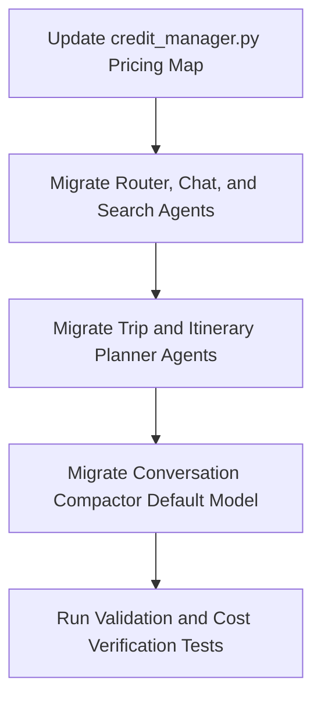

# Task Spec: Gemini LTS Migration & Cost Optimization

**Status: ✅ COMPLETED** (2026-05-27)

- **Summary:** Migrate the backend's Gemini LLM models from deprecated preview versions to Generally Available (GA) Stable versions before the July 9, 2026 deprecation deadline. Update the billing credit system with the new cost metrics, estimate the updated cost structure, and enforce the required thought signature circulation for stable reasoning.
- **Background:** We received notification from Google that Gemini preview models (`gemini-2.5-flash-lite-preview-09-2025`, `gemini-2.5-flash-preview-09-2025`, `gemini-2.5-flash-preview-05-20`, and `gemini-3.1-flash-lite-preview`) will be discontinued on Gemini Enterprise Agent Platform on July 9, 2026. Transitioning to stable GA models ensures system reliability, while updating our credit engine maintains operational margin.
- **Primary Owner:** Cristian (Lead Developer / Project Owner)

---

## 1. Task Overview
As part of Google's roadmap, preview models are being discontinued to make way for highly stable, generally available (GA) counterparts. This task involves updating all backend agents, routers, and helper utilities in the `/backend` FastAPI codebase to use stable production models. 

### Model Transition Map
| Component | Retired Preview Model | Recommended GA Migration Target | Rationale |
| :--- | :--- | :--- | :--- |
| **RouterAgent** | `gemini-3.1-flash-lite-preview` | `gemini-3.1-flash-lite` | GA low-latency utility. |
| **ChatAgent** | `gemini-3.1-flash-lite-preview` | `gemini-3.1-flash-lite` | Fast, low-cost conversational utility. |
| **SearchAgent** | `gemini-3.1-flash-lite-preview` | `gemini-3.1-flash-lite` | Search grounding helper. |
| **TripAgent** | `gemini-3-flash-preview` | `gemini-3.5-flash` | Frontier speed + reasoning capability for tool use. |
| **PlannerAgent** | `gemini-3-flash-preview` | `gemini-3.5-flash` | Superior reasoning for structured, multi-day itineraries. |
| **Compaction** | `gemini-2.5-flash-lite` | `gemini-3.1-flash-lite` | Preemptive migration (all Gemini 2.5 models scheduled for retirement by Oct 2026). |

---

## 2. Objectives & Success Criteria
### Goals
- Fully migrate all 6 agents/handlers in `/backend` to stable GA model equivalents.
- Maintain identical output schemas, system prompt compliance, and function-calling integrations.
- Update `credit_manager.py` to reflect the updated pricing models, ensuring credit deductions align with actual GCP expenses.
- Document and implement thought signature circulation best practices for multi-turn reasoning context.

### Non-Goals
- We are not refactoring the core agent graphs or introducing new tool chains.
- We are not migrating the `/frontend` Next.js codebase.
- We are not editing the database models or tables.

### Definition of Done
- [ ] All 6 codebases (`agent.py`, `chat_agent.py`, `router_agent.py`, `search_agent.py`, `trip_agent.py`, `planner_agent.py`, `conversation_manager.py`) updated to use the new model strings.
- [ ] `credit_manager.py` updated with the new model rates.
- [ ] Unit and integration test suites updated and verified passing (excluding the legacy pre-refactor test failures).
- [ ] Cost analysis validated and recorded in this specification.

---

## 3. System Context
The backend is a FastAPI core running inside Google Cloud Run. It consumes Supabase for user profiles/trips, Supabase for transaction records/credits, and communicates with Gemini using the `google-genai` Python SDK via a regional `Vertex AI` client factory.

### Vertex AI vs. Google Gen AI Developer API (AI Studio)
Since we are using the `google-genai` SDK, we can configure our factory to call the Enterprise Vertex AI endpoints or the Developer API. We primarily leverage **Vertex AI** for our production environment because:
1. **Enterprise SLAs & Compliance:** Guaranteed uptime, enterprise support, and SOC 2 / HIPAA security compliance.
2. **Data Privacy:** Customer data (prompts/outputs) is contractually guaranteed never to be reviewed by humans or used to train Google's models.
3. **Provisioned Throughput (PT):** Enables buying reserved capacity with flat billing, guaranteeing high QPS and low latency without hitting rate limits.
4. **Regional Endpoints:** Allows binding model executions to specific locations (e.g. `europe-west1`) for GDPR compliance and reduced network latency.

---

## 4. Constraints & Requirements
### Technical Constraints
- Must remain compatible with **Python 3.13** as specified in our `Dockerfile`.
- Must use the official **`google-genai`** SDK syntax.
- **Thought Signature Circulation:** Gemini 3 models generate encrypted `thought signatures` reflecting internal reasoning. For multi-turn workflows, these thought signatures must be passed back to the model. Since our agents handle tool calling inside single-turn execution using the SDK's `automatic_function_calling=True`, the SDK handles thought signatures internally. However, for conversational history, we pass raw chat text; we must document that if we migrate to structured `Content` history in the future, we must preserve all parts (including signatures) to avoid `400 (Invalid Argument)` errors.

---

## 5. Cost Analysis & Pricing Comparison
### Token Pricing (USD per 1 Million Tokens)
The stable models feature improved token efficiency and reasoning quality but reflect higher production costs per token.

| Model ID | Input Price (Current) | Input Price (New GA) | Output Price (Current) | Output Price (New GA) | Delta % |
| :--- | :--- | :--- | :--- | :--- | :--- |
| **`gemini-3.5-flash`** | $0.50 | $1.50 | $3.00 | $9.00 | +200.0% |
| **`gemini-3.1-flash-lite`** | $0.10 | $0.25 | $0.40 | $1.50 | +150.0% (In) / +275.0% (Out) |

### Estimated Cost per Interaction (USD & Credits)
Let's analyze a heavy travel planning interaction combining Router (`gemini-3.1-flash-lite`), Search ground (`gemini-3.1-flash-lite` + grounding flat fee), specialized TripAgent (`gemini-3.5-flash`), and an amortized Compaction call.

```
Assumed average token sizes:
- Router: 1,500 Input / 100 Output
- Search: 2,000 Input / 200 Output
- TripAgent: 6,000 Input / 800 Output
- Compaction: 4,000 Input / 200 Output (triggers once every 6 turns)
- Grounding: 1 flat Google Search call ($0.035)
```

#### 1. Current Cost Structure (Preview Models)
- **Router:** `(1,500 * $0.10 / 1e6) + (100 * $0.40 / 1e6)` = **$0.00019**
- **Search:** `(2,000 * $0.10 / 1e6) + (200 * $0.40 / 1e6)` = **$0.00028**
- **TripAgent:** `(6,000 * $0.50 / 1e6) + (800 * $3.00 / 1e6)` = **$0.00540**
- **Compaction:** `[(4,000 * $0.10 / 1e6) + (200 * $0.40 / 1e6)] / 6` = **$0.00008**
- **Grounding Flat Charge:** **$0.03500**
- **Total USD Per Turn:** **$0.04095**
- **Credit Equivalent (with 3x token markup & 2x grounding markup at 0.90 USD/EUR):**
  - Token EUR: `$0.00595 * 0.90 * 100 * 3` = **1.60 credits**
  - Grounding EUR: `$0.03500 * 0.90 * 100 * 2` = **6.30 credits**
  - **Total Deducted Per Interaction:** **~8 credits**

#### 2. New Cost Structure (GA Stable Models)
- **Router:** `(1,500 * $0.25 / 1e6) + (100 * $1.50 / 1e6)` = **$0.000525**
- **Search:** `(2,000 * $0.25 / 1e6) + (200 * $1.50 / 1e6)` = **$0.000800**
- **TripAgent:** `(6,000 * $1.50 / 1e6) + (800 * $9.00 / 1e6)` = **$0.016200**
- **Compaction:** `[(4,000 * $0.25 / 1e6) + (200 * $1.50 / 1e6)] / 6` = **$0.000217**
- **Grounding Flat Charge:** **$0.035000**
- **Total USD Per Turn:** **$0.052742**
- **Credit Equivalent (with 3x token markup & 2x grounding markup at 0.90 USD/EUR):**
  - Token EUR: `$0.017742 * 0.90 * 100 * 3` = **4.79 credits**
  - Grounding EUR: `$0.03500 * 0.90 * 100 * 2` = **6.30 credits**
  - **Total Deducted Per Interaction:** **~11 credits**

> [!TIP]
> Operational costs will increase by approximately **28.8% in USD** and **37.5% in user credit deduction**. This is well within safe margins since our standard signup grant is 500 credits.

---

## 6. Implementation Plan



### Step 1: Update Economy Module
#### [MODIFY] [credit_manager.py](file:///d:/Dev/Apps/agentic-traveler/backend/src/agentic_traveler/economy/credit_manager.py)
Update the `MODEL_PRICING` dictionary to support the new model IDs and reflect stable prices.
```python
MODEL_PRICING: Dict[str, Dict[str, float]] = {
    "gemini-2.5-flash":              {"input": 0.30, "output": 2.50},
    "gemini-2.5-flash-lite":         {"input": 0.10, "output": 0.40},
    "gemini-3.5-flash":              {"input": 1.50, "output": 9.00},  # NEW
    "gemini-3.1-flash-lite":         {"input": 0.25, "output": 1.50},  # NEW
    "gemini-3.0-flash":              {"input": 0.50, "output": 3.00},
    "gemini-3-flash-preview":        {"input": 0.50, "output": 3.00},
    "gemini-3.1-flash-lite-preview": {"input": 0.10, "output": 0.40},
}
```

### Step 2: Migrate Core Orchestration and Router Agents
#### [MODIFY] [router_agent.py](file:///d:/Dev/Apps/agentic-traveler/backend/src/agentic_traveler/orchestrator/router_agent.py#L28)
```python
_MODEL = "gemini-3.1-flash-lite"
```
#### [MODIFY] [search_agent.py](file:///d:/Dev/Apps/agentic-traveler/backend/src/agentic_traveler/orchestrator/search_agent.py#L19)
```python
_MODEL = "gemini-3.1-flash-lite"
```
#### [MODIFY] [chat_agent.py](file:///d:/Dev/Apps/agentic-traveler/backend/src/agentic_traveler/orchestrator/chat_agent.py#L26)
```python
_MODEL = "gemini-3.1-flash-lite"
```

### Step 3: Migrate Heavy-Duty Reasoning Agents
#### [MODIFY] [trip_agent.py](file:///d:/Dev/Apps/agentic-traveler/backend/src/agentic_traveler/orchestrator/trip_agent.py#L26)
```python
_MODEL = "gemini-3.5-flash"
```
#### [MODIFY] [planner_agent.py](file:///d:/Dev/Apps/agentic-traveler/backend/src/agentic_traveler/orchestrator/planner_agent.py#L29)
```python
_MODEL = "gemini-3.5-flash"
```

### Step 4: Migrate Conversational Compactor
#### [MODIFY] [conversation_manager.py](file:///d:/Dev/Apps/agentic-traveler/backend/src/agentic_traveler/orchestrator/conversation_manager.py#L43)
```python
    def __init__(
        self,
        client: Optional[genai.Client] = None,
        model_name: str = "gemini-3.1-flash-lite",
    ):
```

### Step 5: Update Main Orchestrator Dispatches
#### [MODIFY] [agent.py](file:///d:/Dev/Apps/agentic-traveler/backend/src/agentic_traveler/orchestrator/agent.py)
Ensure that `OrchestratorAgent` logs token usage for the exact updated models:
```python
            model_name = {
                "CHAT": "gemini-3.1-flash-lite",
                "TRIP": "gemini-3.5-flash",
                "PLAN": "gemini-3.5-flash",
            }.get(intent, "gemini-3.5-flash")
```

---

## 7. Testing & Validation
### Test Strategy
1. **Mocked Unit Tests:** Verify that all agent initializers match the updated model IDs, and their process requests pass the correct keys.
2. **Pricing Verification Test:** Run the `test_pricing.py` test suite to check that the cost math works accurately with the updated multipliers.

### Acceptance Test Commands
To execute unit tests:
```bash
..\.venv\Scripts\pytest tests/economy/test_pricing.py
..\.venv\Scripts\pytest tests/analytics/test_usage_tracker.py
```

---

## 8. Risk Management
- **Incompatible Outputs:** Gemini 3.5 Flash may output slightly different vocabulary or structure than Gemini 3 Flash Preview. 
  - *Mitigation:* The system prompt already enforces strict Telegram limits and formatting guidelines. We will test edge-cases manually in staging.
- **Credit Drift:** Underestimating token usage with a new model could drain credits faster than expected.
  - *Mitigation:* The 3x token markup is a generous buffer that protects the project's bottom-line.

---

## 9. Delivery & Handoff
- **Deliverables:** A complete pull request containing updates to `credit_manager.py`, `router_agent.py`, `search_agent.py`, `chat_agent.py`, `trip_agent.py`, `planner_agent.py`, `conversation_manager.py`, and `agent.py`.
- **Sign-off:** Approved by Cristian.

---

## 10. Appendix
- **LTS (Long-Term Support):** In GCP, these are GA Stable releases that guarantee API compatibility and deprecation warnings at least 6 months in advance.
- **Thought Signature:** Encrypted context block holding reasoning metadata.
