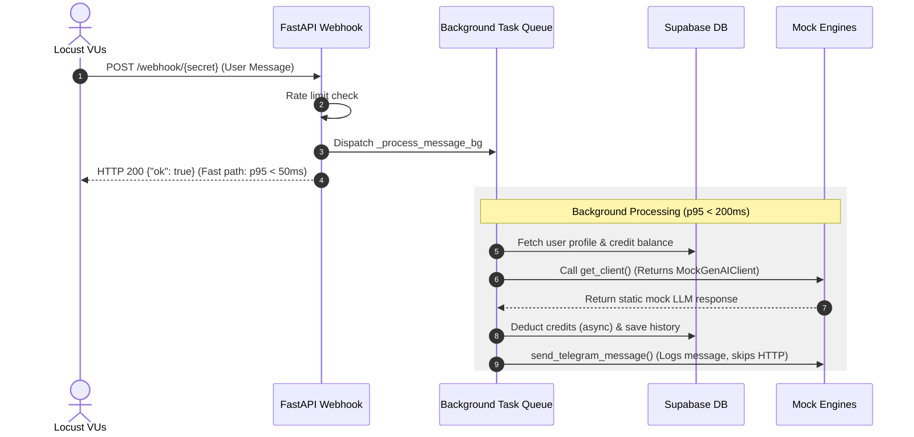

# Task Spec: Repeatable Performance & Load Testing with Locust

- **Summary:** Establish a repeatable performance and load-testing harness using Locust to validate backend throughput and latency goals under concurrent load. Introduce built-in mock modes for both Gemini LLM (`MOCK_LLM=true`) and the Telegram API (`MOCK_TELEGRAM=true`) to enable cost-free, high-concurrency simulation of core routing, database interactions, and framework overhead.
- **Background:** Responsive user experience is critical for retaining travelers. To avoid external service latency, quota throttling, or financial charges during development/CI testing, we must establish a localized framework test harness that isolates our application's performance boundaries.
- **Primary Owner:** Lead Developer

---

## 1. Task Overview
This task establishes a standard, repeatable performance test suite using the **Locust** load-testing framework. To support high-volume simulation, we will add toggleable mock engines directly into the backend. These mock engines will intercept outgoing HTTP/gRPC requests, returning immediate synthetic responses for LLM reasoning and Telegram operations.

---

## 2. Objectives & Success Criteria
### Goals
- Introduce `MOCK_LLM` and `MOCK_TELEGRAM` environment toggle configurations in the backend codebase.
- Write a clean, modular `locustfile.py` defining typical user conversation flows (profile linking, casual chat, travel queries, promo codes).
- Support executing load tests against both a local dev instance (`http://localhost:8080`) and a deployed staging Cloud Run endpoint.
- Benchmark and document p50/p95 latency and request throughput baselines under a simulation of **50 concurrent virtual users**.

### Non-Goals
- We are not load-testing the `/frontend` Next.js dashboard.
- We are not benchmarking real-world Gemini API throughput or Telegram API gateway speeds.
- We are not deploying a persistent monitoring dashboard (Grafana/InfluxDB) as part of this specific scope.

### Definition of Done
- [ ] Toggleable mock systems (`MOCK_LLM`, `MOCK_TELEGRAM`) implemented in the backend and verified via environment variables.
- [ ] A repeatable Locust test file created at `backend/tests/performance/locustfile.py`.
- [ ] Performance tests verified running successfully against a local FastAPI container.
- [ ] A single script `backend/scripts/run_perf_test.ps1` created to spin up the local server in mock mode, execute the Locust CLI in headless mode, and export a CSV/HTML report.
- [ ] Latency targets validated under mock load:
  - **FastAPI Endpoint Response (immediate 200 ok):** p95 < 50ms.
  - **Background Task Processing (from queue to completion):** p95 < 200ms in full mock mode.

---

## 3. System Context
The `/backend` service is a FastAPI application. The main entry point for conversational interactions is the `/webhook/{secret}` endpoint in `telegram.py`. 
When a payload is received, FastAPI immediately validates the Telegram IP and the secret path token, verifies user rate limits, and dispatches processing to a FastAPI `BackgroundTasks` queue to return a `200 OK` response to Telegram within milliseconds.



---

## 4. Constraints & Requirements
### Technical Constraints
- **Test Suitability:** Mock configurations must reside behind flag guards (`MOCK_LLM=true`, `MOCK_TELEGRAM=true`) so they are 100% inactive in standard development, staging, or production environments.
- **Dependency Isolation:** Outgoing calls to `api.telegram.org` and `generativeai` must bypass network requests completely when flags are active.
- **Stateless Database Integration:** Supabase database calls (user fetching/credit deductions) should still execute to measure real DB query latency, but the Locust script must reuse/rotate a set of pre-existing test user IDs to avoid polluting production tables with junk data.

---

## 5. Inputs & Resources
### Artifacts Provided
- Webhook endpoint definitions inside `backend/src/agentic_traveler/interfaces/routers/telegram.py`.
- Client factory structures inside `backend/src/agentic_traveler/orchestrator/client_factory.py`.

### Assumptions
- Developers have Python virtual environment configured (`.venv`) with ability to install `locust` package.
- A local Supabase emulator or test schema is accessible for DB queries during local testing.

---

## 6. Implementation Plan

### Step 1: Implement Built-in Mock LLM Client
#### [MODIFY] [client_factory.py](backend/src/agentic_traveler/orchestrator/client_factory.py)
Introduce a lightweight, duck-typed mock client that mimics the `google-genai` client structure.

```python
class MockGenAIClient:
    class MockModels:
        def generate_content(self, model, contents, config=None):
            import json
            
            class MockUsageMetadata:
                prompt_token_count = 120
                candidates_token_count = 60
                
            class MockCandidate:
                class MockContent:
                    parts = []
                content = MockContent()
                grounding_metadata = None

            class MockResponse:
                usage_metadata = MockUsageMetadata()
                candidates = [MockCandidate()]
                
            # Simulate Intent Router JSON response
            if "lite" in model or "router" in model:
                MockResponse.text = json.dumps({
                    "intent": "CHAT",
                    "request_summary": "Performace test simulated query",
                    "preference_updated": None,
                    "response": None
                })
            else:
                # Standard Agent response
                MockResponse.text = "*Mocked travel suggestion!* You should visit Rome and enjoy the local culinary scenes."
                
            return MockResponse()

    def __init__(self, **kwargs):
        self.models = self.MockModels()
```

Inject this class at the top of the client factory `get_client()` function if the environment flag is active:
```python
def get_client() -> Optional[genai.Client]:
    if os.getenv("MOCK_LLM", "").lower() in ("1", "true"):
        logger.info("Initializing Mock GenAI Client for performance testing")
        return MockGenAIClient()
    ...
```

---

### Step 2: Implement Built-in Zero-Overhead Mock Telegram Functions
#### [MODIFY] [telegram.py](backend/src/agentic_traveler/interfaces/routers/telegram.py)
To ensure **absolutely zero runtime overhead in production**, we will conditionally define the message dispatch routines at module load/import time. By reading the flag once during import, the production code executes the compiled real-world code directly, completely avoiding per-request variable evaluation.

```python
MOCK_TELEGRAM = os.getenv("MOCK_TELEGRAM", "").lower() in ("1", "true")

if MOCK_TELEGRAM:
    logger.info("⚡ MOCK_TELEGRAM mode active: Outgoing Telegram API calls will be bypassed")
    
    def send_telegram_message(chat_id: int | str, text: str) -> int | None:
        logger.debug("MOCK_TELEGRAM: sent message to %s: %s", chat_id, text[:60])
        return 888888  # Synthetic message ID

    def edit_telegram_message(chat_id: int | str, message_id: int, text: str) -> None:
        logger.debug("MOCK_TELEGRAM: edited message %s to %s", message_id, text[:60])
        return
else:
    def send_telegram_message(chat_id: int | str, text: str) -> int | None:
        # Actual production implementation
        ...
        
    def edit_telegram_message(chat_id: int | str, message_id: int, text: str) -> None:
        # Actual production implementation
        ...
```

---

### Step 3: Create the Locust Test Harness
#### [NEW] [locustfile.py](backend/tests/performance/locustfile.py)
Construct a modular load-testing file that simulates realistic user conversation streams using Locust.

```python
import os
import random
from locust import HttpUser, task, between

class TelegramUser(HttpUser):
    wait_time = between(1, 3)  # Simulate user thinking time
    
    def on_start(self):
        """Configure test context and headers."""
        self.secret_token = os.getenv("TELEGRAM_SECRET_TOKEN", "mock_secret")
        self.headers = {
            "Content-Type": "application/json",
            "X-Telegram-Bot-Api-Secret-Token": self.secret_token
        }
        # Use a consistent mock user ID per Virtual User (VU) to test cache/Supabase DB locks
        self.user_id = str(random.randint(100000, 999999))
        self.chat_id = random.randint(10000000, 99999999)

    @task(1)
    def test_health_check(self):
        """Verify baseline HTTP server capability."""
        self.client.get("/health")

    @task(10)
    def test_casual_chat(self):
        """Simulate sending normal conversational queries."""
        payload = {
            "update_id": random.randint(10000, 99999),
            "message": {
                "message_id": random.randint(100, 999),
                "from": {
                    "id": self.user_id,
                    "is_bot": False,
                    "first_name": "VU",
                    "username": f"vu_{self.user_id}"
                },
                "chat": {
                    "id": self.chat_id,
                    "type": "private"
                },
                "text": random.choice([
                    "Hello bot!",
                    "How are you doing today?",
                    "Tell me a travel joke!",
                    "Who created you?"
                ])
            }
        }
        self.client.post(f"/webhook/{self.secret_token}", json=payload, headers=self.headers)

    @task(5)
    def test_travel_query(self):
        """Simulate heavy travel advisory query."""
        payload = {
            "update_id": random.randint(10000, 99999),
            "message": {
                "message_id": random.randint(100, 999),
                "from": {
                    "id": self.user_id,
                    "is_bot": False,
                    "first_name": "VU",
                },
                "chat": {
                    "id": self.chat_id,
                    "type": "private"
                },
                "text": "Recommend 3 nice beaches in Bali, under $1000 budget."
            }
        }
        self.client.post(f"/webhook/{self.secret_token}", json=payload, headers=self.headers)
```

---

### Step 4: Write Repeatable Execution Script
#### [NEW] [run_perf_test.ps1](backend/scripts/run_perf_test.ps1)
A single command shell script to boot local API, run headless load tests, and export findings.

```powershell
# run_perf_test.ps1
# Setup virtual environment and toggle mock parameters
$env:MOCK_LLM = "true"
$env:MOCK_TELEGRAM = "true"
$env:SKIP_IP_CHECK = "true"
$env:TELEGRAM_SECRET_TOKEN = "perf_test_secret"

Write-Host "🚀 Booting FastAPI local server in MOCK mode..." -ForegroundColor Green
$serverProcess = Start-Process -FilePath "..\.venv\Scripts\uvicorn" -ArgumentList "agentic_traveler.interfaces.main:app --host 127.0.0.1 --port 8080" -PassThru -NoNewWindow

# Wait for startup
Start-Sleep -Seconds 3

Write-Host "📈 Initializing Locust headless load test..." -ForegroundColor Green
locust -f tests/performance/locustfile.py --host http://127.0.0.1:8080 --headless -u 50 -r 5 --run-time 1m --csv=tests/performance/reports/locust_summary

Write-Host "🛑 Shutting down FastAPI local server..." -ForegroundColor Red
Stop-Process -Id $serverProcess.Id

Write-Host "✅ Performance test run completed! Reports are available at tests/performance/reports/" -ForegroundColor Green
```

---

## 7. Testing & Validation
### Test Strategy
Validation targets both the harness's scripts and the application's actual performance envelopes under high load:
1. **Mock Verification:** Spin up uvicorn locally with mock flags, execute 1 curl request to webhook, and confirm no Gemini API keys are queried.
2. **Headless Execution Verification:** Run `run_perf_test.ps1` to ensure the Locust engine spawns, reaches 50 concurrent virtual users, runs for 60 seconds, and shuts down gracefully without crashing.

---

## 8. Risk Management
- **Mock Drift:** Mock LLM response structures can drift from actual Google GenAI SDK models, creating false positives.
  - *Mitigation:* Explicitly verify that the `MockResponse` returned by the mock client conforms to the schema expected by `router_agent.py` and token logging functions.
- **Port Conflict:** Local uvicorn fails to boot if port `8080` is in use.
  - *Mitigation:* The startup script will verify port availability before launching.

---

## 9. Delivery & Handoff
- **Deliverables:**
  - Mock handlers in `client_factory.py` and `telegram.py`.
  - The standard Locust script: `backend/tests/performance/locustfile.py`.
  - The automated test script: `backend/scripts/run_perf_test.ps1`.
- **Review:** Checked and approved by Lead Developer.

---

## 10. Appendix
- **VU (Virtual User):** A single Locust simulated thread running tasks sequentially with specific wait intervals.
- **Headless Mode:** Executing Locust load tests directly from the console interface without rendering the HTML frontend, printing summaries to stdout.
